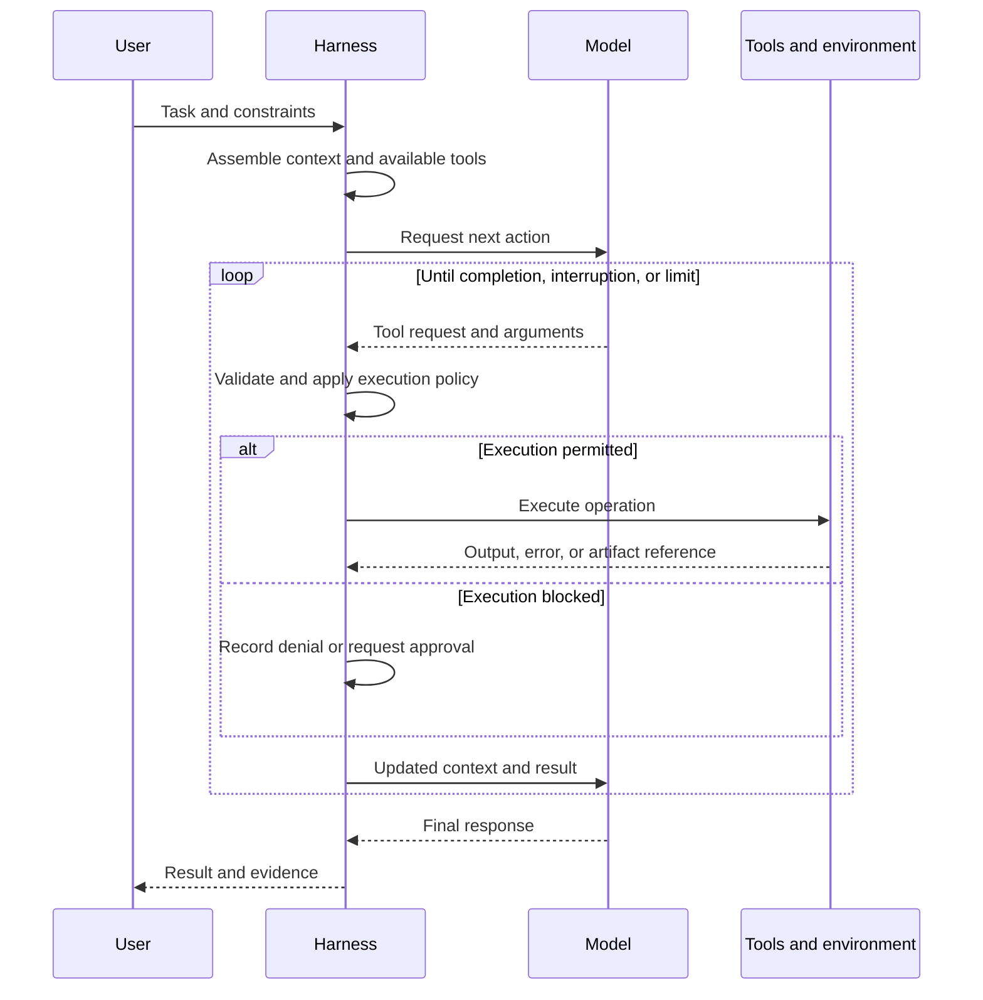

# How Agents Work

**Greg Van Aken: September 15, 2026**

> AI Use Disclosure: Codex was used to research, organize, and draft this guide.

An agent system combines a model with a runtime, tools, and an environment in which actions have observable results. This article introduces those parts and the loop connecting them. Research and business examples are illustrative; named coding products provide concrete implementation examples.

**Audience and prerequisites:** Readers exploring agentic AI across applications. No coding background is required; the diagram shows the flow of a task.

## Contents

- [The parts of an agent system](#the-parts-of-an-agent-system)
- [What happens inside the agent loop](#what-happens-inside-the-agent-loop)
- [Illustrative example: a research brief](#illustrative-example-a-research-brief)

## The parts of an agent system

The word *agent* often refers to a whole product, but its components have different responsibilities.

| Component | Responsibility | Example |
| --- | --- | --- |
| **Model** | Interprets the current input and generates text or structured requests for actions. | Chooses a source to inspect or proposes a draft response. |
| **Harness** | Runs the interaction loop; assembles context, dispatches tools, manages state, and applies execution policies. | The runtime behind an interactive assistant or background worker. |
| **Tools** | Perform operations in an environment and return results. | Document search, file reading, record updates, browser interaction. |
| **Environment** | Holds task data and execution state. | Documents, business records, applications, or a code checkout. |
| **Workspace instructions** | Supply standing guidance for work in an environment. | Research scope, reporting conventions, or project commands. |
| **Skills** | Package discoverable procedures and supporting resources for particular tasks. | A source-checking or browser-verification workflow. |
| **Hooks and checks** | Run at defined events or validation stages. | A policy check before an action or a validation after a result. |
| **Subagents** | Perform delegated work through additional agent loops. | Investigate one question and return findings. |

OpenAI’s description of Codex separates the model from the harness that manages conversations, tool execution, and policy. This distinction explains why the same model can behave differently in different applications: it receives different context, tools, and runtime support. [Codex as a platform](https://developers.openai.com/blog/codex-as-a-platform).

Deployment changes where these pieces run. Coding agents illustrate several choices: a terminal agent may operate in a local checkout, an integrated development environment (IDE) adds editor context and controls, and a remote agent can produce a pull request asynchronously. Each arrangement places the agent loop in a particular environment with particular tools.

In an illustrative customer-support workflow, the environment could contain tickets and account records. The tools could retrieve a policy, look up an order, and save a draft reply. The model would interpret the request; the harness would execute allowed tool calls and return their results.

## What happens inside the agent loop

The central mechanism is a repeated exchange between model inference—generating a response from the available input—and external execution. In an application-managed tool call, the model emits a tool name and arguments; application code executes the operation and supplies the result to a subsequent model invocation. One user request can therefore contain many model calls and tool operations. [OpenAI function calling](https://developers.openai.com/api/docs/guides/function-calling).

This diagram shows logical responsibilities. Some tools execute inside a provider’s infrastructure; some run locally or through external services. Not every action requires a separate network round trip visible to the user.

For a debugging task, the next action might be a repository search. Its output reveals a relevant file. Reading that file reveals a likely cause. The model then proposes a patch and requests a test. A failing test supplies evidence for the next revision. The agent’s behavior emerges from this sequence of observations and decisions, rather than from a complete implementation plan calculated once at the beginning.

The harness also handles operational concerns: waiting for a long-running process, limiting output, recovering from an error, and stopping when a budget or user interruption requires it. Claude Code’s documentation describes an iterative gather-context, act, and verify loop supported by file, search, execution, and other tools. [How Claude Code works](https://code.claude.com/docs/en/how-claude-code-works).

Two consequences matter:

- **A requested action is not a completed action.** A proposed command, an executed command, and a successful command are different events.
- **A final answer is not a correctness certificate.** The model can decide it is finished despite incomplete coverage or a mistaken interpretation of the task. Completion needs evidence from the environment and, where appropriate, review.

## Illustrative example: a research brief

Suppose a user asks an agent to compare three published approaches to a problem, with links to the supporting evidence. A possible loop is:

1. Read the question, scope, and required output format.
2. Search for candidate sources, then open the relevant documents.
3. Extract the claims, evidence, dates, and limitations needed for the comparison.
4. Identify a missing detail or disagreement and retrieve more evidence.
5. Draft the brief and check that each conclusion is supported by the cited material.

The next search depends on what earlier sources reveal. A successful search alone does not complete the task: the result needs to answer the comparison question and account for unresolved gaps. This is an invented example of how observations guide subsequent actions.

## Related reading

- [How language models work](../language-models/how-language-models-work.md) explains generation and assistant training.
- [Reasoning models](../language-models/reasoning-models.md) connects intermediate model work to tool execution and evidence.
- [Context engineering and memory](../context-and-memory/context-engineering-and-memory.md) explains which information reaches each step of the loop.
- [Skills, tools, hooks, and delegation](../tool-use-and-integrations/skills-tools-hooks-and-delegation.md) explains how procedures and capabilities fit together.
- [Topic index and further reading](README.md) lists supporting documentation.
